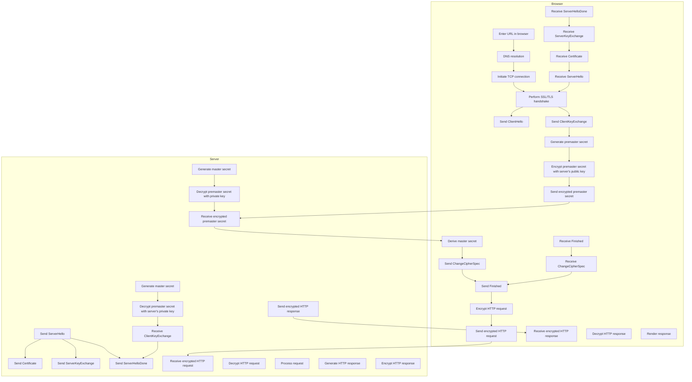
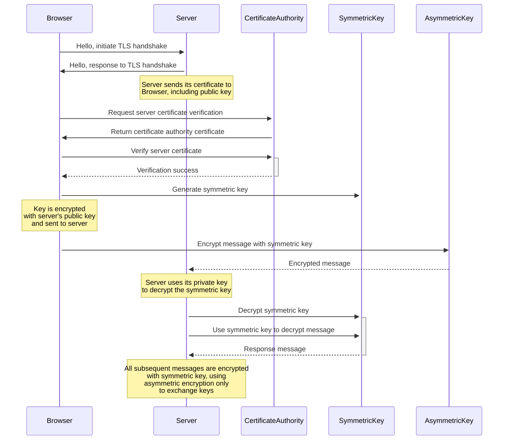

HTTPS flow involves following steps.

```mermaid
graph TD;
  subgraph Browser
    A[Enter URL in browser] --> B[DNS resolution];
    B --> C[Initiate TCP connection];
    C --> D[Perform SSL/TLS handshake];
    D --> E[Send ClientHello];
    F[Receive ServerHello] --> D;
    G[Receive Certificate] --> F;
    H[Receive ServerKeyExchange] --> G;
    I[Receive ServerHelloDone] --> H;
    D --> J[Send ClientKeyExchange];
    J --> K[Generate premaster secret];
    K --> L[Encrypt premaster secret with server's public key];
    L --> M[Send encrypted premaster secret];
  end
  subgraph Server
    M --> N[Receive encrypted premaster secret];
    O[Decrypt premaster secret with private key] --> N;
    P[Generate master secret] --> O;
    Q[Send ServerHello];
    Q --> R[Send Certificate];
    Q --> S[Send ServerKeyExchange];
    Q --> T[Send ServerHelloDone];
    U[Receive ClientKeyExchange] --> T;
    V[Decrypt premaster secret with server's private key] --> U;
    W[Generate master secret] --> V;
  end
  subgraph Browser
    N --> X[Derive master secret];
    X --> Y[Send ChangeCipherSpec];
    Y --> Z[Send Finished];
    AA[Receive ChangeCipherSpec] --> Z;
    AB[Receive Finished] --> AA;
    Z --> AC[Encrypt HTTP request];
    AC --> AD[Send encrypted HTTP request];
  end
  subgraph Server
    AD --> AE[Receive encrypted HTTP request];
    AF[Decrypt HTTP request];
    AG[Process request];
    AH[Generate HTTP response];
    AI[Encrypt HTTP response];
    AJ[Send encrypted HTTP response];
  end
  subgraph Browser
    AJ --> AK[Receive encrypted HTTP response];
    AL[Decrypt HTTP response];
    AM[Render response];
  end
```

------------------------------------

```mermaid
sequenceDiagram
    participant Browser
    participant Server
    participant CertificateAuthority
    participant SymmetricKey
    participant AsymmetricKey

    Browser->>+Server: Hello, initiate TLS handshake
    Server->>Browser: Hello, response to TLS handshake
    Note over Server: Server sends its certificate to<br/>Browser, including public key
    Browser->>+CertificateAuthority: Request server certificate verification
    CertificateAuthority->>+Browser: Return certificate authority certificate
    Browser->>+CertificateAuthority: Verify server certificate
    CertificateAuthority-->>-Browser: Verification success
    Browser->>+SymmetricKey: Generate symmetric key
    Note over Browser: Key is encrypted<br/>with server's public key<br/>and sent to server
    Browser->>AsymmetricKey: Encrypt message with symmetric key
    AsymmetricKey-->>Server: Encrypted message
    Note over Server: Server uses its private key<br/>to decrypt the symmetric key
    Server->>+SymmetricKey: Decrypt symmetric key
    Server->>SymmetricKey: Use symmetric key to decrypt message
    SymmetricKey-->>-Server: Response message
    Note over Server: All subsequent messages are encrypted<br/>with symmetric key, using<br/>asymmetric encryption only<br/>to exchange keys

```

    

