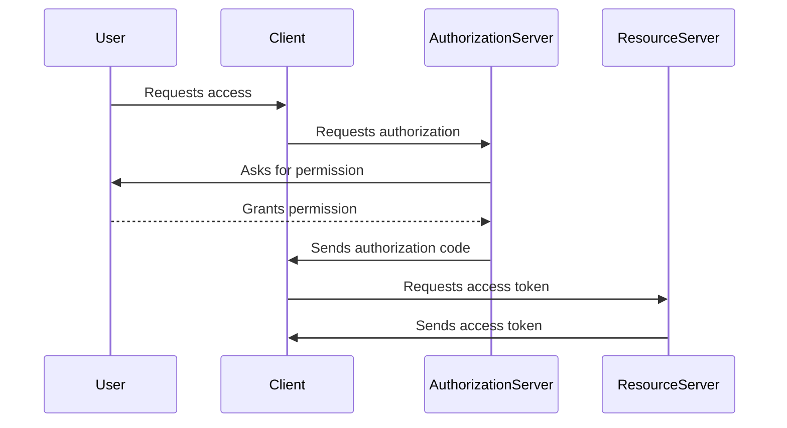
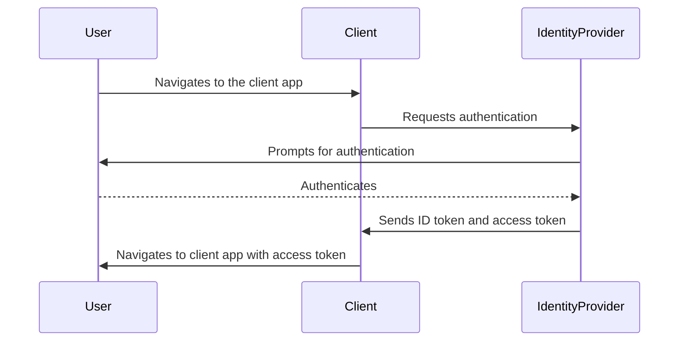

### O-auth-2 sequence
OAuth2 is a protocol for authorization, allowing third-party applications to access resources on behalf of a user, without the user having to give their credentials to the third-party application. This is useful for scenarios such as allowing a mobile app to access a user's Google Drive files, without the user having to share their Google login credentials with the app.

### Oidc sequence 
OpenID Connect (OIDC) is built on top of OAuth2 and provides an authentication layer. OIDC allows a user to authenticate with an identity provider (such as Google or Facebook) and then receive a JSON Web Token (JWT) which can be used to prove their identity to other applications. This allows applications to trust the user's identity without having to handle the user's credentials directly.

